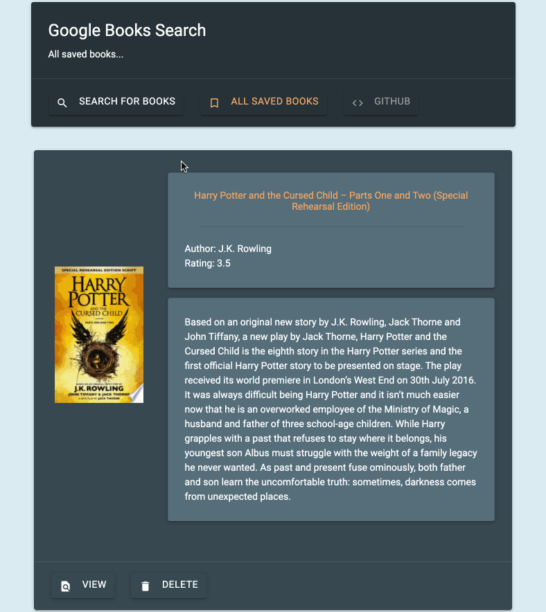

# Google Books Search! (MongoDB, Express, Node, React)
Demo: https://pure-island-43331.herokuapp.com/

Google Books Organizer. Find and manage books using Google Books API. Create, read, and delete books.

# Application
- `git clone <repo>`
- `npm install`
- Start dev: `npm start`

## Built on MERN

## Powered by React-Bootstrap, React-Materialize, React-Animate

# Technologies
- MongoDB
- Express.js
- Node.js
- React.js
- Materialize
- Bootstrap
- React Animate
- Google Books API